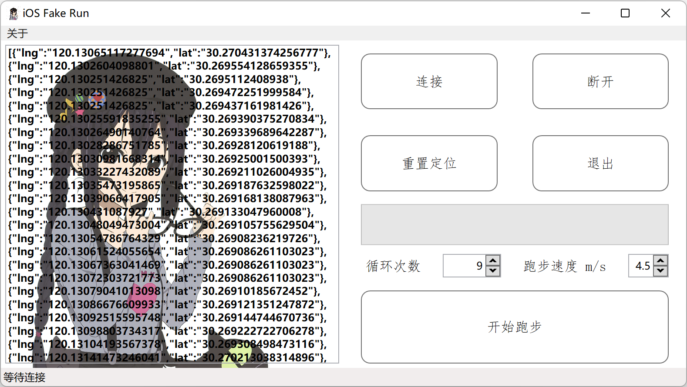

# iOS Fake Run

基于虚拟定位的 iOS 虚拟跑步

## 使用方法

+ 如果你的电脑不具有 .NET 6.0 环境，请在 [此处](https://dotnet.microsoft.com/en-us/download/dotnet/6.0) 下载并安装 .NET Desktop Runtime 6.0
+ 下载 [iOS Fake Run](https://github.com/Mythologyli/iOSFakeRun/releases) 软件并解压到空文件夹中
+ 虚拟定位需要开发者镜像。软件预置了 iOS 14/15/16 的开发者镜像。

  如果你的 iOS 版本低于 14，请执行以下步骤:
    + 进入 [DeveloperDiskImage](https://github.com/Mythologyli/DeveloperDiskImage) 仓库
    + 查看自己的 iOS 版本，下载对应的 DeveloperDiskImage.dmg 和 DeveloperDiskImage.dmg.signature
    + 进入 iOS Fake Run 软件文件夹。在 DeveloperDiskImage 文件夹中建立以版本号为名称的文件夹（如 13.7），将刚才下载的两个文件放入此文件夹

  如果你的 iOS 为 16，请执行以下步骤:
    + 进入设置 > 隐私与安全性
    + 打开开发者模式开关

+ 打开[路径拾取网站](https://fakerun.myth.cx)。通过点击地图构造路径。点击时无需考虑间距，会自动用直线连接。路径点击完成后，单击上方的路径坐标——复制，将坐标数据复制到剪贴板
+ 打开 iOS Fake Run 软件，将坐标数据粘贴到左侧的文本输入框中
+ 将 iOS 设备连接至电脑并解除设备锁屏。你需要确保电脑上的相关驱动正确（安装 iTunes 即可）
+ 点击连接按钮将 iOS 设备连接到软件。设置路径循环次数和跑步速度，点击开始跑步即可开始
+ 跑步结束后，点击重置定位恢复 iOS 设备的正常定位，否则设备在重启前将保持在虚拟定位上

## 免责声明

作者为学习 .NET 开发此软件。作者对软件的用途不做任何说明或暗示。对使用本软件造成的一切后果概不负责

## 致谢

+ [libimobiledevice](https://github.com/libimobiledevice/libimobiledevice)
+ [imobiledevice-net](https://github.com/libimobiledevice-win32/imobiledevice-net)
+ [Json.NET](https://www.newtonsoft.com/json)
+ [Extended WPF Toolkit™](https://github.com/xceedsoftware/wpftoolkit)